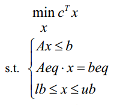
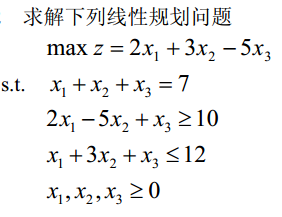
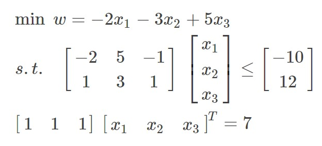
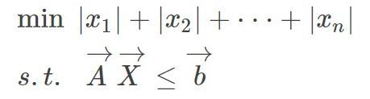
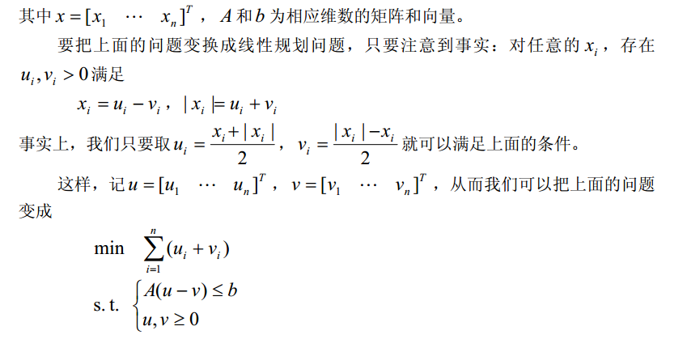
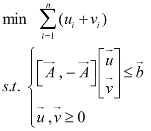
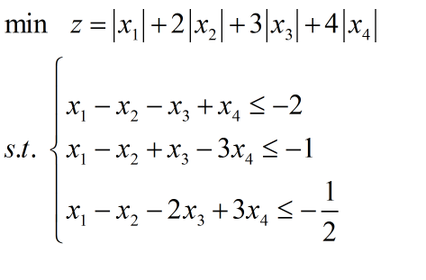
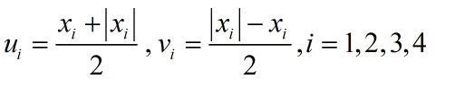
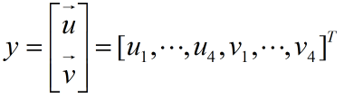
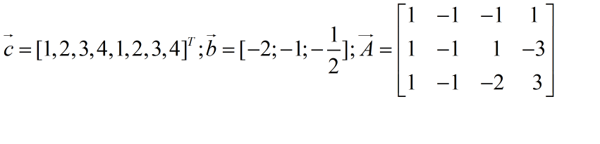

# 线性规划

### 1 线性规划

#### 1.1 概念

略

#### 1.2 线性规划的Matlab标准形式



其中$c$和$x$ 为n 维列向量，$A$ 、 $Aeq$ 为适当维数的矩阵，$b$ 、$beq$为适当维数的列向 量。 

#### 1.3 线性规划问题解的概念

可行解

可行域

#### 1.4 图解法

#### 1.5 Matlab解法

几个不等式是问题的约束条件，记为 s.t.(即 subject to)。 MATLAB中求解线性规划的命令为：
$$
[ x，fval ]=linprog（f，A，b）
$$

$$
[ x，fval ]=linprog（f，A，b，Aeq，beq）
$$

$$
[ x，fval ]=linprog（f，A，b，Aeq，beq，lb，ub）
$$


其中：返回的$x$为决策向量的取值； 返回的$fval$是目标函数的最大值；$f$为价值向量；$A$和$b$对应的是线性不等式约束；$Aeq$和$beq$对应的是线性等式约束；$lb$和$ub$分别对应的是决策向量的下界向量和上界向量。

##### 例题2



（1）matlab标准型：



（2）程序如下

```matlab
f=[-2,-3,5]'
A=[-2,5,-1;1,3,1];  b=[-10;12];
Aeq=[1,1,1];    beq=7;
[x,fval]=linprog(f,A,b,Aeq,beq,zeros(3,1));
x
fval=-fval

% 资料上给的源码
c=[2;3;-5]; 
a=[-2,5,-1;1,3,1]; 
b=[-10;12]; 
aeq=[1,1,1]; 
beq=7; 
x=linprog(-c,a,b,aeq,beq,zeros(3,1)) value=c'*x 
```

#### 1.6 可以转化为线性规划的问题

##### 例题4



可进一步把模型改写为：

eg：

做变量变换

并把新变量重新排列成一维向量

即可把模型变换为线性规划模型，其中：

(2)程序如下

```matlab
c=[1:4];c=[c,c]';
a=[1,-1,-1,1;1,-1,1,-3;1,-1,-2,3]; a=[a,-a];
b=[-2;-1;1/2];
[y,fval]=linprog(c,a,b,[],[],zeros(8,1));
x=y(1:4)-y(5:8)
```

